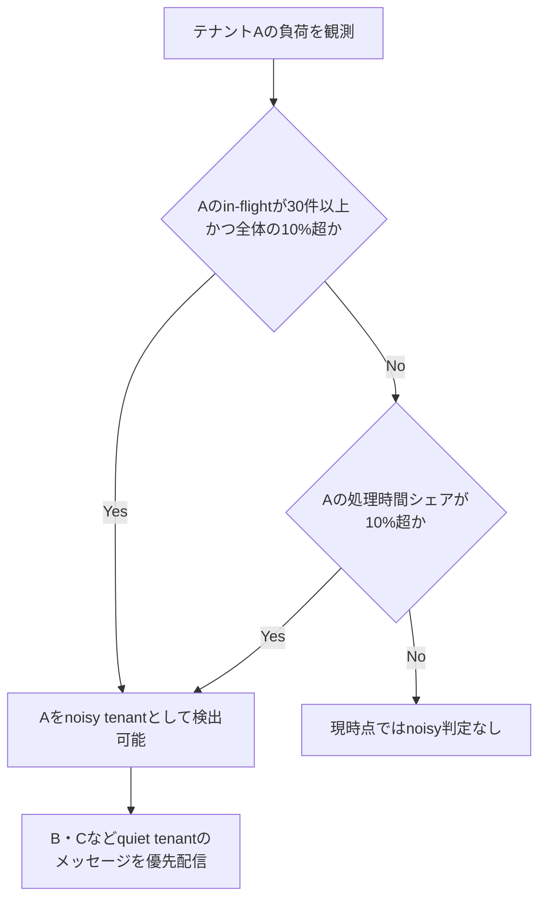
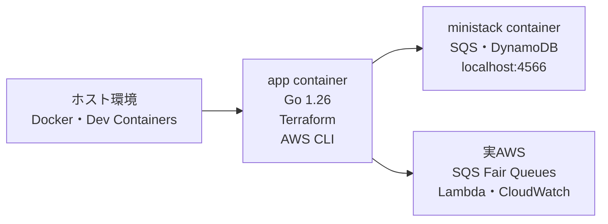
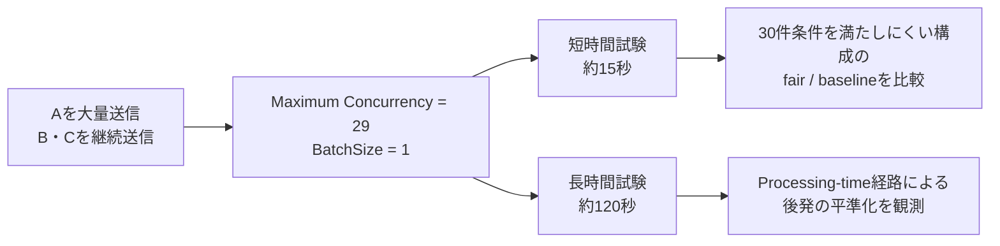
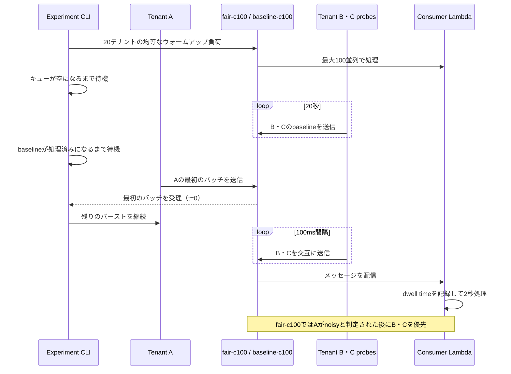

# Amazon SQS Fair Queues 検証環境

Amazon SQS Standard QueueでFair Queuesを利用し、次の2点をAWS上で検証するためのコードです。

1. Lambdaの最大同時実行数を29に制限したとき、Fair Queuesの2つの検出経路がどう動くか
2. テナントAのバースト発生後、静かなテナントB・Cのdwell timeが平常値へ戻るまでの時間

ConsumerはGoのLambda、AWSリソースはTerraform、負荷生成と結果回収はGo CLIで実装しています。開発環境にはDev Containerを使用します。

## 最初に押さえるFair Queuesの判定条件

Fair Queuesは、同じ`MessageGroupId`を持つメッセージを同一テナントとして扱います。テナントがnoisy neighborと判定される条件は次のどちらかです。

- Concurrency share経路：テナントが全in-flightの10%を超え、かつ自身のin-flightが30件以上
- Processing-time share経路：直近の総処理時間に占めるテナントの割合が10%を超える

したがって「コンシューマーが30未満ならFair Queuesは動かない」という条件ではありません。正しくは、同一テナントのin-flightが30件未満ならConcurrency share経路の30件条件を満たせない、です。



AWSは分散システムであり、しきい値付近の判定は近似です。また、Processing-time shareの集計期間や内部の判定時刻は公開されていません。この検証ではサービス内部の時刻を直接測るのではなく、B・Cのdwell timeが継続的に改善した時刻を反応時間として扱います。

## シナリオ名

`c100`、`c29`、`c30`は、SQSイベントソースマッピングに設定するLambdaのMaximum Concurrencyを表します。

| シナリオ | MessageGroupId | Maximum Concurrency | 用途 |
|---|---|---:|---|
| `fair-c100` | テナントID | 100 | 30件条件へ到達できるFair Queues |
| `baseline-c100` | なし | 100 | `fair-c100`の比較対象 |
| `fair-c29` | テナントID | 29 | 30件境界の直前を観測するFair Queues |
| `baseline-c29` | なし | 29 | `fair-c29`の比較対象 |
| `fair-c30` | テナントID | 30 | Lambda上限30での挙動を探索するFair Queues。A自身の30件到達は前提にしない |
| `baseline-c30` | なし | 30 | 探索的な`fair-c30`の比較対象 |

キュー自体はすべてStandard Queueです。`fair-*`と`baseline-*`の違いは、実験CLIが送信時に`MessageGroupId`を付けるかどうかです。

## 全体構成

```mermaid
flowchart LR
    Runner["Go experiment CLI<br/>負荷生成・結果回収"]

    subgraph C100["Maximum Concurrency = 100"]
        FC100["fair-c100<br/>Standard Queue<br/>MessageGroupIdあり"] --> FL100["Go Consumer Lambda<br/>BatchSize = 1"]
        BC100["baseline-c100<br/>Standard Queue<br/>MessageGroupIdなし"] --> BL100["Go Consumer Lambda<br/>BatchSize = 1"]
    end

    subgraph C29["Maximum Concurrency = 29"]
        FC29["fair-c29<br/>Standard Queue<br/>MessageGroupIdあり"] --> FL29["Go Consumer Lambda<br/>BatchSize = 1"]
        BC29["baseline-c29<br/>Standard Queue<br/>MessageGroupIdなし"] --> BL29["Go Consumer Lambda<br/>BatchSize = 1"]
    end

    subgraph C30["Maximum Concurrency = 30"]
        FC30["fair-c30<br/>Standard Queue<br/>MessageGroupIdあり"] --> FL30["Go Consumer Lambda<br/>BatchSize = 1"]
        BC30["baseline-c30<br/>Standard Queue<br/>MessageGroupIdなし"] --> BL30["Go Consumer Lambda<br/>BatchSize = 1"]
    end

    Runner --> FC100
    Runner --> BC100
    Runner --> FC29
    Runner --> BC29
    Runner --> FC30
    Runner --> BC30

    FL100 --> Logs["CloudWatch Logs<br/>message_started JSON"]
    BL100 --> Logs
    FL29 --> Logs
    BL29 --> Logs
    FL30 --> Logs
    BL30 --> Logs
    Logs --> Runner
    Metrics["SQS・Lambda Metrics"] --> Dashboard["CloudWatch Dashboard"]
```



`BatchSize=1`に固定することで、1回のLambda実行が保持するin-flightメッセージを1件にします。Lambdaの同時実行数とSQSのin-flight件数は完全に同一のメトリクスではありませんが、バッチによる倍率を排除できます。

## Dev Container

ホスト側にGoやTerraformを直接インストールする必要はありません。Dev Containerには次の環境が含まれています。

- Go 1.26
- Terraform
- AWS CLI
- VS CodeのGo、Terraform、AWS Toolkit拡張
- SQSとDynamoDBを提供するMinistack



MinistackはGoコードの開発や基本的なSQS API確認に利用します。Fair Queuesのスケジューリング、Lambdaイベントソースマッピング、CloudWatchメトリクスを含む最終検証は実AWSで行います。

### 起動

VS Codeでは、このリポジトリを開いて`Dev Containers: Reopen in Container`を実行します。初回起動時はコンテナのビルド、Goモジュールのダウンロード、Ministackの疎通確認が自動実行されます。

CLIからコンテナだけ起動する場合：

```bash
docker compose -f .devcontainer/docker-compose.yml up -d --build
docker compose -f .devcontainer/docker-compose.yml exec app bash
```

コンテナ内のワークスペースは`/workspace`です。

```bash
cd /workspace
go version
terraform version
aws --version
aws --endpoint-url "$AWS_ENDPOINT" sqs list-queues
```

## Consumerが記録する値

Consumerは処理を始めた直後に、次のJSONを標準出力へ記録します。

```json
{
  "event_type": "message_started",
  "experiment_id": "reaction-20260704T120000Z",
  "scenario": "fair-c100",
  "tenant": "B",
  "phase": "probe",
  "sequence": 12,
  "sqs_sent_ms": 1783140000000,
  "handler_started_ms": 1783140000234,
  "dwell_ms": 234,
  "work_ms": 2000
}
```

`dwell_ms`は、SQSが付与した`SentTimestamp`からLambdaハンドラー開始までの時間です。ログ出力後は`work_ms`だけ`time.Sleep`し、メッセージを意図的にin-flightへ保持します。

## 検証1：最大同時実行数29での挙動

`fair-c29`と`baseline-c29`を使用します。`BatchSize=1`かつLambda Maximum Concurrencyを29に設定し、同時呼び出し数を29以下へ制限します。Lambda同時実行数とSQS in-flightは同一の値ではないため、`ApproximateNumberOfMessagesNotVisible`も合わせて確認します。

ただし、Aが29スロットを長時間占有すると、Aの処理時間シェアはほぼ100%になります。この場合はProcessing-time share経路でnoisy tenantと判定される可能性があります。そのため、短時間試験と長時間試験に分けます。



### 1-A：短時間試験

```bash
build/experiment run-low \
  --mode short \
  --config build/experiment-config.json
```

確認する内容：

- Lambda最大同時実行数が29以下である
- 1秒間隔の`GetQueueAttributes`観測でSQSのApproximate in-flightが概ね29以下である
- Aの`handler-active estimate`が30未満で推移したか
- 短い観測期間でB・Cのdwell timeに改善が現れるか

これは「Concurrency share経路の30件条件を満たしにくい構成での早期挙動」を見る試験です。`GetQueueAttributes`はApproximateであり、イベントソースマッピングがLambda呼び出し前に保持するメッセージもあり得るため、「常に厳密に30未満」とは表現しません。Fair Queuesが動かないことや、AWS内部の判定経路を直接証明する試験でもありません。

### 1-B：長時間試験

```bash
build/experiment run-low \
  --mode long \
  --config build/experiment-config.json
```

長時間継続した後に`fair-c29`だけB・Cのdwell timeが改善した場合、Processing-time share経路が働いた可能性を示します。AWS内部の集計窓は非公開なので、`ApproximateNumberOfNoisyGroups`とbaselineとの差を合わせて判断します。

## 29/30境界試験（探索的）

同じ短時間負荷をMaximum Concurrency 29と30で別々に実行します。

```bash
build/experiment run-boundary \
  --concurrency 29 \
  --config build/experiment-config.json

build/experiment run-boundary \
  --concurrency 30 \
  --config build/experiment-config.json
```

各条件を5〜10回実行し、Fair/Baseline差、B・Cの回復時間、SQS in-flight、`ApproximateNumberOfNoisyGroups`を比較します。ただし、これはLambda Maximum Concurrencyの境界に対する探索的試験です。Maximum ConcurrencyとA自身のSQS in-flightは同一ではなく、デフォルトではB・Cが約20スロットを使うため、`c30`を「Aが30件以上」の証拠には使用しません。Concurrency share経路が成立し得る側は、`fair-c100`でAの`handler-active estimate >= 30`を確認して代表させます。

## 検証2：バースト後の反応時間

`fair-c100`と`baseline-c100`へ同じ負荷を送ります。



見る値は次のとおりです。

- バースト開始後のB・Cの`dwell_ms`時系列
- バースト前baselineから算出した平常範囲へ、B・Cの両方が戻るまでの時間
- `fair-c100`と`baseline-c100`のp50・p95
- Aの`handler-active estimate`が30件以上となったか、およびその継続時間
- Aの`handler-active estimate / ApproximateNumberOfMessagesNotVisible` proxyが10%を超えたか
- Aのバックログが残っているのにB・Cが先に処理されたか
- `ApproximateNumberOfNoisyGroups`が0より大きくなったか

`BatchSize=1`なので、collectorは各メッセージの半開区間`[handler_started_ms, handler_started_ms + work_ms)`を重ね合わせ、テナント別の同時処理数を再構成します。この区間はメッセージが確実に処理中である部分だけを数えるため、SQS in-flight件数の下限推定です。ハンドラー開始前の受信時間と終了後の削除遅延は含みません。テナント別handler-active件数同士の比率は`handler_active_share`として出力しますが、除外区間がテナントごとに異なり得るため、SQS in-flightシェアの下限とは扱いません。

10%条件との整合性確認には、1秒ごとの`A handler-active / ApproximateNumberOfMessagesNotVisible`を`count_share_proxy`として別途出力します。分子はハンドラー開始前のin-flightメッセージを含まない下限推定で、分母はSQSのApproximate属性です。そのため`criteria_proxy_met=true`は観測値がConcurrency share条件と整合したことを示す強い補助証拠として扱いますが、AWS内部判定の直接的な証明ではありません。`false`の場合も、AWS内部で条件を満たさなかったとは判断しません。

30件以上側の代表証拠には`fair-c100`を使用します。デフォルト負荷ではB・Cプローブが100msごとに1件、各2秒処理されるため、定常時に合計約20スロットを使います。そのため`c30`でA自身が30件へ到達することは期待しません。

CloudWatchのSQSメトリクスは1分粒度なので、秒単位の反応時間にはConsumerログを使います。実験CLIはこれとは別に、実験中の`GetQueueAttributes`をデフォルト1秒間隔で保存します。属性値自体はApproximateであるため、厳密な上限の証明ではなく観測された短時間ピークの証拠として扱います。取得失敗は0へ変換せず`status=error`の欠測行として保存し、次のtickで再試行します。5回連続で失敗した場合もmanifestと部分CSVを保存してからエラー終了します。`ApproximateNumberOfNoisyGroups`も補助証拠です。

実行例：

```bash
build/experiment run-reaction \
  --config build/experiment-config.json \
  --burst 30000 \
  --probes 6000 \
  --probe-interval 100ms \
  --baseline-duration 20s \
  --work-ms 2000
```

1回の結果だけで断定せず、キューを空にした状態から5〜10回実行し、反応時間の中央値とp95を比較してください。各実行で`collect`まで完了した後、次の例で検証2の`recovery-estimate.json`をシナリオ別に集計できます。

```bash
jq -s '
  def pct($p): sort | .[(((length - 1) * $p) | floor)];

  add
  | group_by(.scenario)
  | map(
      . as $runs
      | [$runs[]
          | select(.recovery_observed == true and .recovery_latency_ms != null)
          | .recovery_latency_ms] as $values
      | {
          scenario: $runs[0].scenario,
          total_runs: ($runs | length),
          recovered_runs: ($values | length),
          unrecovered_runs: (($runs | length) - ($values | length)),
          median_ms: (if ($values | length) > 0 then ($values | pct(0.50)) else null end),
          p95_ms: (if ($values | length) > 0 then ($values | pct(0.95)) else null end),
          min_ms: (if ($values | length) > 0 then ($values | min) else null end),
          max_ms: (if ($values | length) > 0 then ($values | max) else null end)
        }
    )
' results/reaction-*/recovery-estimate.json
```

中央値・p95は回復を観測できた試行だけから計算されるため、`total_runs`、`recovered_runs`、`unrecovered_runs`を必ず併記してください。回復しなかった試行を無視して中央値だけを比較すると、結果を良い側へ偏らせます。

## 必要なもの

- Docker
- Dev Container対応エディタ、またはDocker Compose
- 実AWS検証時に利用できるAWS認証情報
- Lambda同時実行クォータ

デフォルトでは6関数に合計348のReserved Concurrencyを設定し、各イベントソースの上限より5多く確保します。Lambdaが要求する未予約同時実行枠100も必要になるため、アカウントの同時実行クォータは少なくとも448必要です。クォータが不足する場合は`reserve_concurrency=false`で構築できますが、他ワークロードの影響を受けやすくなります。

実験CLIを実行するIAM主体には、対象キューへの以下の権限が必要です。

- `sqs:SendMessage`
- `sqs:GetQueueAttributes`
- `sqs:PurgeQueue`
- CloudWatch Logsの`StartQuery`と`GetQueryResults`
- CloudWatchの`GetMetricData`

## コンテナ内でのテストとビルド

```bash
cd /workspace
make tidy
make test
make build
```

生成物：

```text
build/
├── experiment
└── lambda/
    ├── bootstrap
    └── consumer.zip
```

## 実AWSへのデプロイ

`docker-compose.yml`の初期値はMinistack用のmock認証情報です。実AWSを操作するターミナルではmock値を解除し、利用するAWSプロファイルを設定します。

```bash
unset AWS_ACCESS_KEY_ID AWS_SECRET_ACCESS_KEY AWS_SESSION_TOKEN AWS_ENDPOINT
export AWS_REGION=ap-northeast-1

aws configure sso --profile fairqueue-verification
export AWS_PROFILE=fairqueue-verification
aws sso login --profile "$AWS_PROFILE"
aws sts get-caller-identity
```

この操作でプロファイルはコンテナ内の`/root/.aws`へ作成されます。コンテナを作り直すとプロファイルも消えるため、必要に応じてホストの`~/.aws`を`/root/.aws`へマウントして永続化してください。

認証確認後、コンテナ内でTerraformを実行します。

```bash
make build

terraform -chdir=terraform init
terraform -chdir=terraform plan
terraform -chdir=terraform apply

terraform -chdir=terraform output -json experiment_config \
  > build/experiment-config.json
```

設定を変更する場合：

```bash
cp terraform/terraform.tfvars.example terraform/terraform.tfvars
```

## 結果の回収

実験終了時に、CLIがmanifestのパスを表示します。

```bash
build/experiment collect \
  --config build/experiment-config.json \
  --manifest results/<experiment-id>/manifest.json
```

次のファイルが生成されます。

```text
results/<experiment-id>/
├── manifest.json
├── queue-depth-samples.csv
├── queue-depth-aligned.csv
├── concurrency-share-proxy.csv
├── events.csv
├── handler-active-estimate.csv
├── handler-active-summary.json
├── summary.json
├── observation-summary.json
├── recovery-estimate.json
└── metrics.json
```

- `events.csv`：メッセージ単位の受信開始時刻とdwell time。LT用の時系列グラフの入力
- `handler-active-estimate.csv`：`handler_started_ms`から`work_ms`の終了までを重ね合わせた、シナリオ・テナント別の同時処理数と`handler_active_share`の時系列。`_all`は全テナント合計
- `handler-active-summary.json`：テナント別の推定同時処理数・handler-active比率の最大値と継続時間。件数は確実に処理中だった区間による下限推定だが、比率はSQS in-flightシェアの下限ではない
- `queue-depth-samples.csv`：バースト送信直前からキューが空になるまで、SQS `GetQueueAttributes`の絶対時刻・visible・not-visible・取得状態をデフォルト1秒間隔で保存。値はApproximateで、取得失敗時の数値欄は空欄。manifestにも実行状態とサンプル総数・エラー数を保存
- `queue-depth-aligned.csv`：collectorが最初のAメッセージのSQS `SentTimestamp`を共通のt=0としてサンプルを補正。ログがない場合のみmanifest時刻へfallbackし、`elapsed_source`へ基準を保存
- `concurrency-share-proxy.csv`：同時刻のA handler-active件数とApproximate not-visibleからcount/share proxyを計算。30件条件、10% proxy、両方の成立フラグを保存。`criteria_proxy_met=true`はConcurrency share条件と整合する補助証拠だが、`false`は内部条件が不成立だったことを意味しない
- `summary.json`：キューが空になるまでの全期間について、シナリオ・テナント・phaseごとの件数、p50、p95、最大dwell time
- `observation-summary.json`：バースト開始からプローブ送信終了までに送信されたメッセージを集計。処理開始が観測窓より後になった遅延メッセージも含む
- `recovery-estimate.json`：最初のAメッセージのSQS `SentTimestamp`をt=0とし、B・Cそれぞれについてbaseline p95から平常範囲を算出。各テナントの直近10件中8件以上が範囲内となり、B・Cの両方が回復した時刻を保存する
- `metrics.json`：SQSのnoisy group・in-flight・quiet group in-flightとLambda同時実行数を1分粒度のMaximumで保存。秒単位の反応時間ではなく補助証拠として使用する

`recovery-estimate.json`の平常範囲の上限（回復しきい値）は、B・Cごとに`max(2 × baseline p95, baseline p95 + 250ms)`で計算します。baselineを取得できなかった場合は`2 × work_ms`へフォールバックします。悪化を観測した後、各テナントの直近10件中8件以上がこのしきい値以下となった最初の窓を回復とし、その窓の最後のメッセージ開始時刻を採用します。`recovery_latency_ms`は悪化検出時点からではなく、Aのバースト開始からB・Cの両方が回復するまでの時間です。このしきい値は本検証の分析用定義であり、AWS Fair Queues内部の判定しきい値ではありません。

CloudWatch Logsまたはメトリクスの到着が遅れて一部件数が不足した場合は、数分待ってから同じ`collect`コマンドを再実行できます。

## 再実行とキューの初期化

実験コマンドは、対象となる2つのキューが空でない場合は開始しません。処理完了を待てない場合のみpurgeします。

```bash
build/experiment purge --config build/experiment-config.json
```

SQSの`PurgeQueue`は連続実行に制限があるため、purge直後は60秒以上空けてください。

## Terraformの削除

```bash
terraform -chdir=terraform destroy
```

DLQにメッセージが残っていても、Terraformによるキュー削除は可能です。実験結果のローカルCSVは`terraform destroy`では削除されません。

## 参考資料

- [How Amazon SQS fair queues work](https://docs.aws.amazon.com/AWSSimpleQueueService/latest/SQSDeveloperGuide/sqs-fair-queues-detailed.html)
- [Available CloudWatch metrics for Amazon SQS](https://docs.aws.amazon.com/AWSSimpleQueueService/latest/SQSDeveloperGuide/sqs-available-cloudwatch-metrics.html)
- [Creating and configuring an Amazon SQS event source mapping](https://docs.aws.amazon.com/lambda/latest/dg/services-sqs-configure.html)
- [Using the message group ID with Amazon SQS queues](https://docs.aws.amazon.com/AWSSimpleQueueService/latest/SQSDeveloperGuide/using-messagegroupid-property.html)
